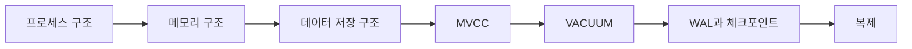

이 블로그에서는 PostgreSQL과 MongoDB의 내부 구조를 운영 관점에서 정리합니다.

## 연재 계획

```mermaid
flowchart LR
  A[프로세스 구조] --> B[메모리 구조] --> C[데이터 저장 구조]
  C --> D[MVCC] --> E[VACUUM] --> F[WAL과 체크포인트] --> G[복제]
```

첫 시리즈는 PostgreSQL 인터널입니다.
